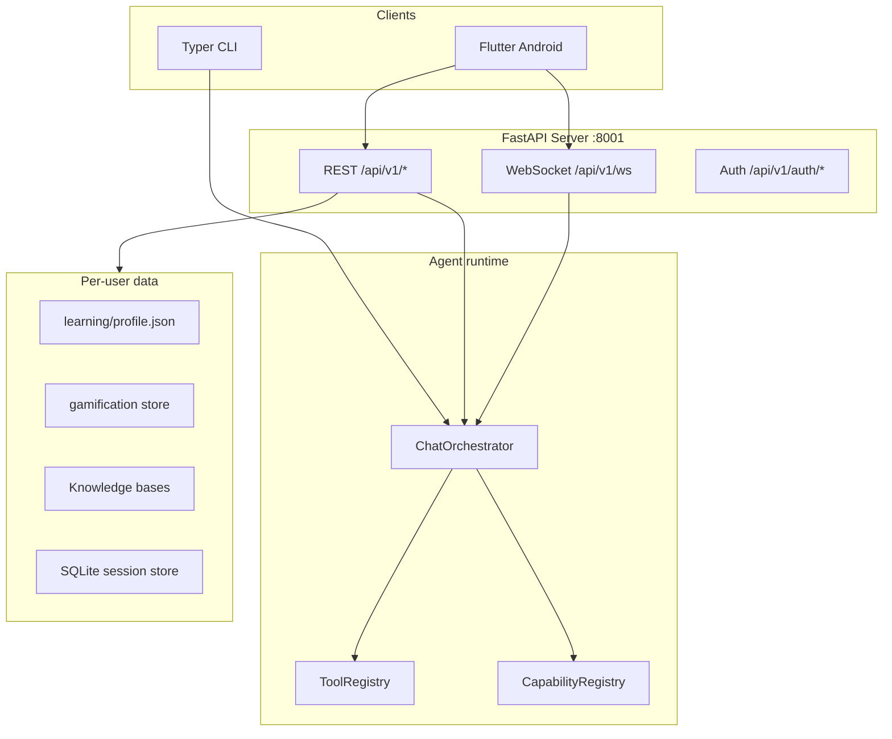
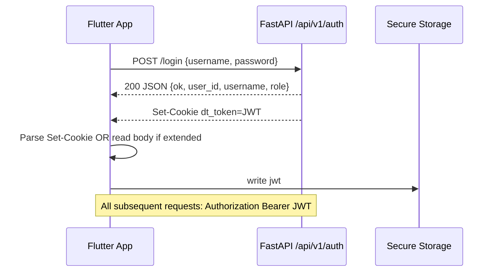
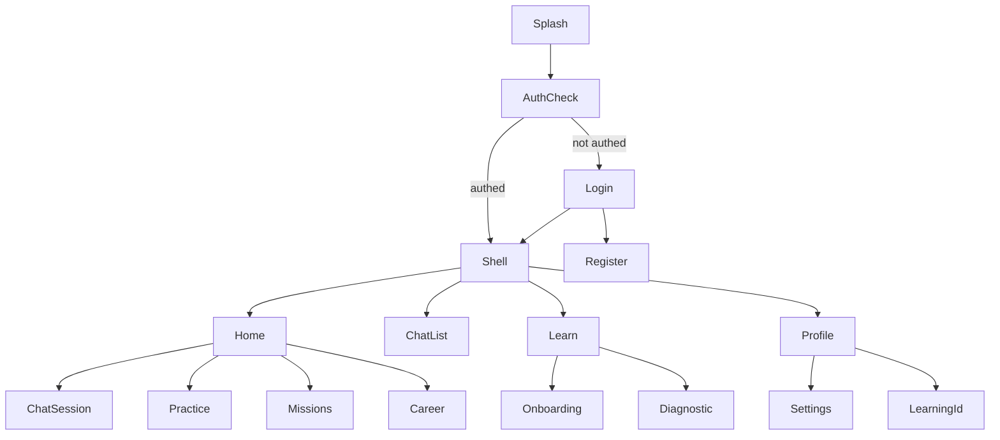

# DeepTutor Flutter (Android) Mobile Application — Technical Specification

**Version:** 1.0  
**Date:** May 2026  
**Audience:** Mobile engineers, solution architects, product owners  
**Source codebase:** [Deep-Tutor](https://github.com/YuvisTechPoint/Deep-Tutor) (FastAPI backend + Flutter mobile)  
**Target platform (phase 1):** Android (Flutter/Dart); iOS can follow the same architecture with platform adapters.

---

## Table of contents

1. [Executive summary](#1-executive-summary)  
2. [DeepTutor platform recap](#2-deeptutor-platform-recap)  
3. [Mobile product scope](#3-mobile-product-scope)  
4. [Architecture: web vs Flutter](#4-architecture-web-vs-flutter)  
5. [Backend connectivity](#5-backend-connectivity)  
6. [Authentication & session](#6-authentication--session)  
7. [REST API reference (mobile-critical)](#7-rest-api-reference-mobile-critical)  
8. [WebSocket protocols](#8-websocket-protocols)  
9. [Dart domain models](#9-dart-domain-models)  
10. [Flutter application architecture](#10-flutter-application-architecture)  
11. [Screen map & navigation](#11-screen-map--navigation)  
12. [Feature implementation guides](#12-feature-implementation-guides)  
13. [Responsive UI & theming](#13-responsive-ui--theming)  
14. [Android-specific engineering](#14-android-specific-engineering)  
15. [Offline, caching & sync](#15-offline-caching--sync)  
16. [Security](#16-security)  
17. [Payments (Razorpay)](#17-payments-razorpay)  
18. [Internationalization](#18-internationalization)  
19. [Development environment](#19-development-environment)  
20. [Phased delivery roadmap](#20-phased-delivery-roadmap)  
21. [Testing strategy](#21-testing-strategy)  
22. [Risks, gaps & backend follow-ups](#22-risks-gaps--backend-follow-ups)  
23. [Appendix A: Full router index](#appendix-a-full-router-index)  
24. [Appendix B: Source file index](#appendix-b-source-file-index)

---

## 1. Executive summary

DeepTutor is an **agent-native intelligent tutoring platform** with a Python/FastAPI backend. The **Flutter Android app** lives in `deeptutor_mobile/` and is the primary learner UI.

This document specifies how to build and extend a **production-grade Flutter Android application** that:

- Talks to the **FastAPI backend** (`deeptutor serve` / `python -m deeptutor.api.run_server`, default port `8001`).
- Reuses **REST contracts and WebSocket protocols** defined in `deeptutor/api/routers/*` and mirrored in `deeptutor_mobile/lib/`.
- Delivers a **responsive, touch-first** experience for learners (chat, practice, onboarding, career, missions, code lab where feasible).
- Handles **auth** via JWT in secure storage (not browser cookies).
- Supports **streaming AI chat** via `/api/v1/ws` (primary) with reconnect and resume.

**Recommended stack:** Flutter 3.24+, Dart 3.5+, `dio` + `web_socket_channel`, `flutter_secure_storage`, `riverpod` or `bloc`, `go_router`, `flutter_localizations`, `firebase_auth` (optional, for Firebase login parity).

---

## 2. DeepTutor platform recap

### 2.1 High-level architecture



### 2.2 Agent-native model (from `docs/agents.md`, `AGENTS.md`)

| Layer | Examples | Mobile relevance |
|-------|----------|------------------|
| **Tools** | `rag`, `web_search`, `code_execution`, `reason`, `brainstorm`, `paper_search` | Selected in chat via `StartTurnMessage.tools` |
| **Capabilities** | `chat`, `deep_solve`, `deep_question`, plugins | Selected via `StartTurnMessage.capability` |
| **Entry points** | CLI, WebSocket API, Python SDK | Mobile uses **WebSocket API** + REST |

### 2.3 Key backend paths

| Path | Purpose |
|------|---------|
| `deeptutor/api/main.py` | App factory, CORS, router mounting, `require_auth` |
| `deeptutor/api/routers/` | All HTTP + WS routes |
| `deeptutor/services/` | Business logic (auth, gamification, practice, coding, RAG, LLM) |
| `deeptutor/runtime/orchestrator.py` | Chat orchestration |
| `deeptutor_mobile/lib/` | **Dart client** implementing API contracts |
| `deeptutor/api/routers/` | **Contract source of truth** for REST/WS shapes |

### 2.4 Existing documentation to read

| Doc | Use for mobile |
|-----|----------------|
| [run.md](run.md) | Backend/LLM setup, ports |
| [code-lab.md](code-lab.md) | Code Lab toolchains (server-side compilers) |
| [deployment.md](deployment.md) | Production URLs, CORS |
| [agents.md](agents.md) | Capability/tool names for chat config |
| `.env.example` | All environment variables |

---

## 3. Mobile product scope

### 3.1 Phase 1 — Android MVP (learner core)

| Feature | Flutter screen | Priority | Notes |
|---------|----------------|----------|-------|
| Auth (login/register) | `LoginScreen`, `RegisterScreen` | P0 | JWT secure storage |
| Dashboard / home | `HomeScreen` | P0 | Tiles: chat, practice, missions, career |
| Unified chat | `ChatThreadScreen` | P0 | `/api/v1/ws` streaming |
| Onboarding | `OnboardingScreen` | P0 | Multi-step flow, `learning-profile` |
| Practice (MCQ) | `PracticeScreen` | P0 | Quiz ephemeral IDs |
| Learning profile | Profile section | P1 | `GET/PUT /api/v1/learning-profile` |
| Missions & XP | `MissionsScreen` | P1 | Gamification APIs |
| Career paths | `CareerScreen` | P1 | REST + optional career WS |
| Notifications | TBD | P2 | Poll or push later |
| Revision queue | TBD | P2 | Spaced repetition |
| Diagnostic | part of onboarding | P1 | `/api/v1/diagnostic` |
| Settings (language) | `SettingsScreen` | P2 | `GET/PUT` settings |

### 3.2 Phase 2 — Enhanced learner

| Feature | Priority | Complexity |
|---------|----------|------------|
| Code Lab | P2 | **High** — server compiles C/C++/Java/JS; editor UX on mobile |
| Billing / Razorpay | P2 | Native Razorpay SDK |
| Calendar + session prep | P3 | Server APIs in `live_session_prep` router |
| Co-writer | P3 | Rich markdown editor |
| TutorBots / agents | P3 | Separate WS per bot |
| Knowledge base upload | P3 | File picker + multipart upload |
| Deep Research / Book | P4 | Long-running streams |

### 3.3 Phase 3 — Admin / institution (optional)

- Admin user management (`/api/v1/auth/users`) — tablet-only or separate app flavor.
- Multi-user grants (`/api/v1/multi-user`) — institution deployments.

### 3.4 Explicit non-goals (phase 1)

- Reimplementing LLM/RAG on device (all inference is server-side).
- Full desktop sidebar layout on phone (use bottom nav + nested stacks).
- Code Lab **native** compilation on device (always server-side `coding-practice` run/submit).

---

## 4. Architecture: API vs Flutter

### 4.1 Contracts to implement in Dart

| Asset | Source | Flutter action |
|-------|--------|----------------|
| REST paths & JSON shapes | `deeptutor/api/routers/*` + OpenAPI at `/docs` | `@JsonSerializable` models in `deeptutor_mobile/lib/` |
| WebSocket event types | `deeptutor/api/routers/unified_ws.py` | `StreamEvent` enum + parser |
| Onboarding domain logic | `tests/services/test_onboarding_config.py` (reference) | `lib/features/onboarding/` |
| Auth | `deeptutor/api/routers/auth.py` | `AuthProvider` + secure token store |
| i18n | `deeptutor_mobile/lib/l10n/*.arb` | `flutter_localizations` |

### 4.2 Native Flutter concerns

| Concern | Flutter approach |
|---------|------------------|
| Navigation | `go_router` + redirect guards |
| Session | `AuthProvider` + `flutter_secure_storage` |
| Chat streaming | `ChatProvider` + `WsClient` |
| HTTP | `Dio` + `Authorization: Bearer` |
| Razorpay | `razorpay_flutter` (phase 2) |
| Code Lab editor | `code_field` / WebView fallback |
| Offline queue | `hive` / local cache |
| Markdown/LaTeX | `flutter_markdown` + math package |
| Proctoring | Android immersive mode + lifecycle listeners |

### 4.3 Home screen (implemented)

`deeptutor_mobile/lib/features/home/screens/home_screen.dart` — tiles for chat, practice, missions, career; gamification header from REST APIs.

---

## 5. Backend connectivity

### 5.1 Base URL resolution

Configure the API base URL in `deeptutor_mobile/lib/core/config/app_config.dart`:

- Default dev: `http://10.0.2.2:8001` (Android emulator → host `localhost:8001`).
- Production: your public API origin (must be **absolute** — no relative paths).

**Flutter configuration:**

```dart
// lib/core/config/app_config.dart
class AppConfig {
  final String apiBase; // e.g. https://api.example.com or http://10.0.2.2:8001
  String get apiV1 => '$apiBase/api/v1';
  String get wsBase => apiBase.replaceFirst('https://', 'wss://').replaceFirst('http://', 'ws://');
}
```

**Android emulator:** use `http://10.0.2.2:8001` to reach host `localhost`.

### 5.2 CORS

Backend (`deeptutor/api/main.py`) allows configured origins via `CORS_ORIGIN` / `CORS_ORIGINS`. Mobile native apps **do not use CORS** for HTTP (not a browser). Ensure server allows your deployment; no extra CORS needed for Dart `dio`.

### 5.3 Health & system status

| Endpoint | Use |
|----------|-----|
| `GET /api/v1/system/status` | Backend version, feature flags |
| `GET /api/v1/auth/status` | Auth enabled + current session |

Poll on app resume (mirror `AuthSessionContext` visibility refresh).

### 5.4 Required environment variables (client)

From `.env.example` + `deeptutor_mobile/lib/core/config/app_config.dart`:

| Variable | Mobile usage |
|----------|--------------|
| `BACKEND_PORT` / build-time `API_BASE` | Dev default `8001` |
| `AUTH_ENABLED` | Show login vs open mode |
| `RAZORPAY_KEY_ID` | Razorpay checkout (phase 2; public key in mobile app config) |
| `FIREBASE_*` | Only if using Firebase sign-in |
| `GOOGLE_OAUTH_*` | Custom Tabs OAuth (not WebView redirect to web) |

LLM keys stay **server-only**; mobile never embeds `LLM_BINDING_API_KEY`.

---

## 6. Authentication & session

### 6.1 Modes

| Mode | `AUTH_ENABLED` | Mobile behavior |
|------|----------------|-----------------|
| Open | `false` | No login; API works as admin user |
| Local JWT | `true`, no PocketBase | Username/password → JWT |
| PocketBase | `true` + `POCKETBASE_URL` | PB token in cookie on web; mobile should use Bearer from login response if PB exposes it |
| Firebase | `true` + Firebase project | `firebase_auth` → `POST /api/v1/auth/firebase` |
| Google OAuth | OAuth client configured | `flutter_appauth` or Google Sign-In + server callback |

**Implementation files:**  
`deeptutor/api/routers/auth.py`, `deeptutor/services/auth.py`, `deeptutor/services/login_lockout.py`

### 6.2 Login flow (local JWT)



**Critical:** Web relies on **httpOnly cookie** `dt_token`. Mobile must:

1. Parse `Set-Cookie` from login response (`dio` cookie jar), **or**
2. Request backend enhancement to return `{ "access_token": "..." }` in JSON (recommended for mobile).

Until JSON token is added, use `dio` with `CookieManager` and also mirror token to `Authorization` header (server accepts both per `require_auth`).

### 6.3 Token storage

| Data | Storage | Key |
|------|---------|-----|
| JWT | `flutter_secure_storage` | `dt_token` |
| Username / role | `shared_preferences` | cache only |
| Auth enabled flag | remote config / first `/auth/status` | |

### 6.4 Session refresh & 401

Web (`apiFetch`): on 401 → redirect `/login?next=...`.

Flutter:

```dart
// Pseudo-code interceptor
onError: (e) {
  if (e.response?.statusCode == 401) {
    authNotifier.logout();
    router.go('/login');
  }
}
```

On `AppLifecycleState.resumed`, call `GET /api/v1/auth/status`.

### 6.5 Firebase sign-in

1. `firebase_auth` → `User.getIdToken()`.
2. `POST /api/v1/auth/firebase` body `{ "id_token": "..." }`.
3. Store session cookie/token like login.

### 6.6 Google OAuth on Android

Web flow: `GET /oauth/google/state` → browser redirect → `POST /oauth/google/callback`.

Mobile options:

- **Option A:** `flutter_appauth` with same client ID; custom redirect `com.yuvistech.deeptutor:/oauth2redirect`.
- **Option B:** Chrome Custom Tab to web callback page (fragile).
- **Option C:** Backend endpoint accepting Google ID token (like Firebase).

Coordinate redirect URI with `GOOGLE_OAUTH_REDIRECT_URI` in server config.

### 6.7 Registration

- `GET /api/v1/auth/is_first_user` → show bootstrap register.
- `POST /api/v1/auth/register` → first user only when store empty.
- Password policy: `deeptutor/services/password_policy.py`.

---

## 7. REST API reference (mobile-critical)

Base: `{apiBase}/api/v1`

### 7.1 Learning profile (onboarding)

| Method | Path | Body |
|--------|------|------|
| GET | `/learning-profile` | — |
| PUT | `/learning-profile` | `LearningProfile` |

**Schema** (`deeptutor/api/routers/learning_profile.py`):

```json
{
  "goals": ["string"],
  "preparing_for": ["school", "engineering", "medical"],
  "target_path": "string",
  "career_path_id": "ml-engineer",
  "domain_answers": { "school_grade": "grade_11_12", "eng_exam": "jee" },
  "weekly_hours": 8.0,
  "learning_styles": ["string"],
  "experience_level": "beginner|intermediate|advanced",
  "prior_summary": "string",
  "diagnostic_completed": true,
  "updated_at": "ISO-8601"
}
```

**Dart:** mirror `deeptutor/api/routers/learning-profile-api.ts`.

**Onboarding logic:** port `deeptutor/api/routers/onboarding-config.ts` (domain tracks, career path filters, dynamic questions).

### 7.2 Career

| Method | Path | Response highlights |
|--------|------|---------------------|
| GET | `/career/paths` | `paths[]`, `recommended_path_id`, `profile_summary`, `stats` |
| GET | `/career/paths/{path_id}` | Single path |

Path IDs: `ml-engineer`, `sde-backend`, `data-scientist`, `engineering-entrance`, `medical-entrance`, `school-academics`.

Catalog: `deeptutor/api/routers/career.py` `_path_catalog()`.

### 7.3 Gamification & missions

| Method | Path |
|--------|------|
| GET | `/gamification/state` |
| GET | `/gamification/xp-history?limit=20` |
| GET | `/gamification/level` |
| GET | `/gamification/badges` |
| GET | `/missions/today` |
| POST | `/missions/{id}/complete` |
| GET | `/missions/rewards/catalog` |
| POST | `/missions/rewards/claim` |

Types: `deeptutor/api/routers/workspace-api.ts` → `GamificationState`, `MissionsToday`.

### 7.4 Practice (MCQ)

| Method | Path | Notes |
|--------|------|-------|
| GET | `/practice/topics` | Topic list |
| GET | `/practice/questions?topic=&difficulty=&limit=` | Returns `quiz_id` + items |
| POST | `/practice/hint` | `{ quiz_id, question_id }` |
| POST | `/practice/check` | Single answer check |
| POST | `/practice/submit` | Full quiz; awards XP |

**Warning:** `quiz_id` is **ephemeral** (in-memory). Server restart → HTTP **410**. Mobile must handle gracefully and refetch questions.

**Offline:** Web uses `deeptutor/api/routers/offline-queue.ts` (IndexedDB). Flutter: queue submits in `hive` when offline.

### 7.5 Diagnostic

| Method | Path |
|--------|------|
| POST | `/diagnostic/start` | Optional `{ topic, difficulty }` |
| POST | `/diagnostic/finish` | `{ quiz_id, answers[] }` |

Topic inferred from learning profile when omitted (`deeptutor/api/routers/diagnostic.py`).

### 7.6 Coding practice (Code Lab)

| Method | Path |
|--------|------|
| GET | `/coding-practice/toolchains` | Per-language compiler availability |
| GET | `/coding-practice/problem?topic=&difficulty=&language=` |
| POST | `/coding-practice/run` | `{ problem_id, code }` |
| POST | `/coding-practice/submit` | + `solve_seconds?` |
| GET/POST | `/coding-practice/exam/*` | Proctoring (phase 2) |

**Server-side execution only.** See [code-lab.md](code-lab.md). Mobile shows toolchain status (green/amber) from `/toolchains`.

Types: `deeptutor/api/routers/coding-practice-api.ts`.

### 7.7 Payments

| Method | Path |
|--------|------|
| GET | `/payments/subscription` |
| GET | `/payments/razorpay/status` |
| POST | `/payments/razorpay/order` |
| POST | `/payments/razorpay/verify` |

### 7.8 Live session prep

| Method | Path |
|--------|------|
| GET/POST | `/live-session/session-drafts` |
| GET/POST | `/live-session/pre-session-requests` |

Types: `deeptutor/api/routers/live-session-prep-api.ts`.

### 7.9 Chat sessions (REST, non-streaming)

| Method | Path |
|--------|------|
| GET | `/chat/sessions?limit=20` |
| GET | `/chat/sessions/{id}` |
| DELETE | `/chat/sessions/{id}` |

Use for history list; live chat uses WebSocket.

### 7.10 Notifications

| Method | Path |
|--------|------|
| GET | `/notifications` |
| POST | `/notifications/{id}/read` |

### 7.11 Revision

| Method | Path |
|--------|------|
| GET | `/revision/queue` |
| POST | `/revision/review` |

### 7.12 Settings

| Method | Path |
|--------|------|
| GET | `/settings/language` |
| PUT | `/settings/language` |

---

## 8. WebSocket protocols

### 8.1 Primary: unified chat (`/api/v1/ws`)

**Spec source:** `deeptutor/api/routers/unified-ws.ts`, `deeptutor/api/routers/unified_ws.py`

**URL:**

```
ws(s)://{host}:{port}/api/v1/ws?token={jwt}
```

Auth: query `token` **or** cookie `dt_token` (prefer query on mobile).

#### Client → server messages

| type | Purpose |
|------|---------|
| `message` / `start_turn` | New user turn (`StartTurnMessage`) |
| `subscribe_turn` | Resume streaming for `turn_id` |
| `subscribe_session` | Session-level events |
| `resume_from` | Reconnect mid-turn (`turn_id`, `seq`) |
| `cancel_turn` | Cancel generation |
| `regenerate` | Regenerate last response |
| `ping` | Heartbeat |

**StartTurnMessage fields (port to Dart):**

```dart
class StartTurnMessage {
  final String type; // 'message' | 'start_turn'
  final String content;
  final List<String>? tools;
  final String? capability;
  final List<String>? knowledgeBases;
  final String? sessionId;
  final List<Attachment>? attachments;
  final String? language;
  final Map<String, dynamic>? config;
  final LlmSelection? llmSelection;
  // notebook_references, history_references, book_references, skills...
}
```

#### Server → client: StreamEvent

| type | UI action |
|------|-----------|
| `stage_start` / `stage_end` | Show capability stage indicator |
| `thinking` | Typing / reasoning indicator |
| `content` | Append assistant markdown |
| `tool_call` / `tool_result` | Tool execution UI |
| `sources` | Citation chips |
| `result` | Structured result payload |
| `error` | Error banner |
| `session` | Update `session_id` |
| `done` | End turn, enable input |

**Client requirements:**

- Heartbeat every 30s; dead connection after 45s (match web).
- Exponential backoff reconnect (max 5 attempts).
- On reconnect, send `resume_from` with last `seq`.

**Flutter package:** `web_socket_channel` + custom `UnifiedWsClient` class (port from `UnifiedWSClient` in `unified-ws.ts`).

### 8.2 Career live updates (`/api/v1/career/ws`)

**Source:** `deeptutor_mobile/lib/features/career/useLiveCareerPaths.ts`, `deeptutor/api/routers/career_updates.py`

Server pushes:

- `{ "type": "career_refresh", ... }` → refetch `GET /career/paths`
- `{ "type": "gamification_update", ... }` → refetch gamification state

Client: `ping`, `unsubscribe`.

**Alternative for mobile:** skip WS; poll `/career/paths` on screen focus (simpler MVP).

### 8.3 Legacy / secondary WebSockets

| Path | Use |
|------|-----|
| `/api/v1/chat` | Legacy streaming (avoid for new mobile code) |
| `/api/v1/tutorbot/{bot_id}/ws` | TutorBot agents |
| `/api/v1/solve` | Deep solve capability |
| `/api/v1/knowledge/{kb}/progress/ws` | KB indexing progress |

Phase 1: **only implement unified `/api/v1/ws`**.

---

## 9. Dart domain models

Organize under `lib/data/models/` with `json_serializable` + `freezed` (recommended).

### 9.1 Core models (generate from TypeScript)

| Dart file | TS source |
|-----------|-----------|
| `auth_status.dart` | `deeptutor/api/routers/auth.ts` |
| `learning_profile.dart` | `deeptutor/api/routers/learning-profile-api.ts` |
| `stream_event.dart` | `deeptutor/api/routers/unified-ws.ts` |
| `start_turn_message.dart` | `deeptutor/api/routers/unified-ws.ts` |
| `gamification_state.dart` | `deeptutor/api/routers/workspace-api.ts` |
| `practice_question.dart` | `deeptutor/api/routers/workspace-api.ts` |
| `coding_problem.dart` | `deeptutor/api/routers/coding-practice-api.ts` |
| `career_path.dart` | `deeptutor/api/routers/workspace-api.ts` |

### 9.2 Example: LearningProfile

```dart
@JsonSerializable()
class LearningProfile {
  final List<String> goals;
  @JsonKey(name: 'preparing_for')
  final List<String> preparingFor;
  @JsonKey(name: 'target_path')
  final String targetPath;
  @JsonKey(name: 'career_path_id')
  final String careerPathId;
  @JsonKey(name: 'domain_answers')
  final Map<String, dynamic> domainAnswers;
  @JsonKey(name: 'weekly_hours')
  final double? weeklyHours;
  @JsonKey(name: 'learning_styles')
  final List<String> learningStyles;
  @JsonKey(name: 'experience_level')
  final String experienceLevel;
  @JsonKey(name: 'prior_summary')
  final String priorSummary;
  @JsonKey(name: 'diagnostic_completed')
  final bool diagnosticCompleted;
  @JsonKey(name: 'updated_at')
  final String? updatedAt;
}
```

### 9.3 Example: StreamEvent

```dart
enum StreamEventType {
  stageStart,
  stageEnd,
  thinking,
  observation,
  content,
  toolCall,
  toolResult,
  progress,
  sources,
  result,
  error,
  session,
  done,
}

class StreamEvent {
  final StreamEventType type;
  final String source;
  final String stage;
  final String content;
  final Map<String, dynamic> metadata;
  final String? sessionId;
  final String? turnId;
  final int? seq;
  final double timestamp;
}
```

Use `@JsonValue` for snake_case JSON from Python.

---

## 10. Flutter application architecture

### 10.1 Recommended layering (clean architecture)

```
lib/
├── main.dart
├── app.dart                    # MaterialApp, theme, router
├── core/
│   ├── config/app_config.dart
│   ├── network/dio_client.dart
│   ├── network/auth_interceptor.dart
│   ├── network/ws_client.dart
│   ├── storage/secure_token_store.dart
│   ├── theme/app_theme.dart
│   └── utils/
├── data/
│   ├── models/
│   ├── repositories/
│   │   ├── auth_repository.dart
│   │   ├── chat_repository.dart
│   │   ├── profile_repository.dart
│   │   ├── practice_repository.dart
│   │   └── ...
│   └── datasources/
│       ├── remote/             # API implementations
│       └── local/              # hive, offline queue
├── domain/
│   ├── entities/
│   └── usecases/
└── features/
    ├── auth/
    ├── home/
    ├── chat/
    ├── onboarding/
    ├── practice/
    ├── career/
    ├── missions/
    ├── profile/
    └── settings/
```

### 10.2 State management

| Option | Recommendation |
|--------|----------------|
| **Riverpod** | Good for DI + async providers (auth, gamification) |
| **Bloc** | Good for chat event streams |

**Chat:** `StreamController<StreamEvent>` fed by `UnifiedWsClient`; UI uses `StreamBuilder` or `Bloc` with sealed states (`ChatIdle`, `ChatStreaming`, `ChatError`).

### 10.3 Dependency injection

Use `riverpod` providers:

```dart
final dioProvider = Provider<Dio>((ref) {
  final token = ref.watch(authTokenProvider);
  return createDio(ref.watch(appConfigProvider), token);
});
```

### 10.4 Error handling

Mirror `summarizeHttpErrorBody` from `deeptutor/api/routers/api.ts`:

- Parse FastAPI `detail` field (string or list).
- Map 503 from coding-practice to toolchain install message.
- Map 410 on practice to "Quiz expired, tap to refresh".

---

## 11. Screen map & navigation

### 11.1 Navigation graph (phase 1)



### 11.2 Shell layout (responsive)

| Form factor | Navigation |
|-------------|------------|
| Phone (&lt;600dp) | `NavigationBar` bottom: Home, Chat, Learn, Profile |
| Tablet (≥600dp) | `NavigationRail` + split panes |
| Foldable | `LayoutBuilder` + dual-pane chat (list + conversation) |

### 11.3 Screen ↔ API mapping

| Screen | Primary APIs |
|--------|--------------|
| Login | `POST /auth/login`, `GET /auth/status` |
| Home | `/gamification/state`, `/missions/today` |
| Chat list | `GET /chat/sessions` |
| Chat thread | `WS /api/v1/ws`, optional `GET /chat/sessions/{id}` |
| Onboarding | `PUT /learning-profile`, `GET /career/paths` |
| Practice | `/practice/*` |
| Career | `GET /career/paths` |
| Missions | `/missions/*`, `/gamification/state` |
| Learning ID | `GET /learning-profile` |
| Code Lab | `/coding-practice/*` |
| Billing | `/payments/*` |

---

## 12. Feature implementation guides

### 12.1 Chat (highest complexity)

**Web reference:** `deeptutor_mobile/lib/features/UnifiedChatContext.tsx`, `deeptutor_mobile/lib/features/(workspace)/chat/[[...sessionId]]/page.tsx`

**Implementation steps:**

1. Build `UnifiedWsClient` with connect, disconnect, send `start_turn`, listen `StreamEvent`.
2. Maintain `sessionId`, `turnId`, message list, streaming buffer.
3. Render assistant content as markdown (`flutter_markdown`).
4. Support attachments: encode images as base64 in `StartTurnMessage.attachments` (match web).
5. Tool/capability picker: static list from `docs/agents.md` tool names.
6. Optional: knowledge base picker → `GET /api/v1/knowledge` list.

**Regenerate / cancel:** send WS `regenerate` / `cancel_turn`.

### 12.2 Onboarding (8 steps)

**Web reference:** `deeptutor_mobile/lib/features/(workspace)/onboarding/page.tsx`, `deeptutor/api/routers/onboarding-config.ts`

| Step | Content |
|------|---------|
| 0 | Welcome |
| 1 | Goals + domain tracks (`school`, `engineering`, `medical`) |
| 2 | Career path cards (filtered by domain) |
| 3 | Domain-specific questions |
| 4 | Weekly hours slider |
| 5 | Learning styles multi-select |
| 6 | Experience level |
| 7 | Notes + diagnostic |

**Sync:** `PUT /learning-profile` on each "Continue" (mirror web `syncDraft`).

**Validation:** port `domainStepComplete`, `stepValidationError` logic from web.

### 12.3 Practice

**Web reference:** `deeptutor_mobile/lib/features/(workspace)/practice/page.tsx`

- Fetch topics → questions → hold `quiz_id`.
- Show one question at a time or scrollable list.
- Hint button → `POST /practice/hint`.
- Submit → `POST /practice/submit` → show XP animation.
- On `OfflineQueuedError` equivalent, queue locally.

### 12.4 Career

**Web reference:** `deeptutor_mobile/lib/features/(workspace)/career/page.tsx`, `deeptutor_mobile/lib/features/career/useLiveCareerPaths.ts`

- Load paths; show readiness %, skill gaps.
- Optional WS for live refresh after XP events.
- Selected path should match `learning_profile.career_path_id`.

### 12.5 Code Lab (phase 2)

**Web reference:** `deeptutor_mobile/lib/features/(workspace)/coding-practice/page.tsx`, `docs/code-lab.md`

- **Do not compile on device.**
- Use `CodeField` or embedded WebView for editing.
- Call `GET /toolchains` before enabling Run.
- Exam mode: Android `SystemChrome.setEnabledSystemUIMode` immersive; `WidgetsBindingObserver` for pause detection → `POST /exam/violation`.

### 12.6 Missions & gamification

**Web reference:** `deeptutor_mobile/lib/features/(workspace)/missions/page.tsx`

- Daily missions list, complete → claim rewards.
- Show streak, level, XP on home.

---

## 13. Responsive UI & theming

### 13.1 Design tokens from web

Web uses CSS variables in `deeptutor_mobile/lib/features/globals.css`:

- `--primary`, `--background`, `--foreground`, `--card`, `--border`, etc.

**Flutter:** define `ThemeData` with `ColorScheme` matching brand (primary ~ `#D4734B` / violet accents from workspace).

### 13.2 Breakpoints

| Breakpoint | Layout |
|------------|--------|
| &lt;360dp | Single column, compact padding |
| 360–600dp | Standard phone |
| 600–840dp | Tablet: rail + content |
| &gt;840dp | Wide: two-column chat, side panels |

Use `MediaQuery.sizeOf(context).width` and `LayoutBuilder`.

### 13.3 Typography

- UI: `Roboto` / system default.
- Code: `JetBrains Mono` (match Code Lab web).

### 13.4 Touch targets

Minimum 48×48 dp for mission cards, quiz options, language chips.

### 13.5 Accessibility

- Semantics labels for streak/XP.
- Screen reader announcements for chat streaming completion.

---

## 14. Android-specific engineering

### 14.1 Project setup

```yaml
# pubspec.yaml (excerpt)
environment:
  sdk: '>=3.5.0 <4.0.0'

dependencies:
  flutter:
    sdk: flutter
  dio: ^5.4.0
  web_socket_channel: ^3.0.0
  flutter_secure_storage: ^9.0.0
  go_router: ^14.0.0
  flutter_riverpod: ^2.5.0
  freezed_annotation: ^2.4.0
  json_annotation: ^4.9.0
  flutter_markdown: ^0.7.0
  connectivity_plus: ^6.0.0
  hive_flutter: ^1.1.0
```

### 14.2 Permissions (`AndroidManifest.xml`)

| Permission | Reason |
|------------|--------|
| `INTERNET` | API + WebSocket |
| `RECORD_AUDIO` | Optional: `POST /speech/transcribe` |
| `READ_MEDIA_IMAGES` | Chat image attachments |
| `POST_NOTIFICATIONS` | Future push (API 33+) |

### 14.3 Network security

- **Cleartext:** allow `10.0.2.2` only in **debug** manifest (`android:usesCleartextTraffic` for dev).
- **Production:** HTTPS only.

### 14.4 Background execution

- WebSocket: disconnect on background unless you implement foreground service (not required MVP).
- On resume: reconnect WS, `resume_from`, refresh auth status.

### 14.5 App links

- `deeptutor://chat/{sessionId}` for notifications (future).
- OAuth redirect intent filter.

### 14.6 Proguard / R8

Keep Gson/json_serializable model classes if using reflection (prefer explicit serializers).

---

## 15. Offline, caching & sync

| Data | Strategy |
|------|----------|
| Auth token | Secure storage only |
| Learning profile | Cache in hive; sync on PUT success |
| Gamification | Short TTL cache (60s); refresh on home focus |
| Practice submit | Outbox queue when offline (`hive` box `offline_queue`) |
| Chat | Show offline banner; queue failed sends optional |
| Career paths | Cache 5 min |

**Web reference:** `deeptutor/api/routers/offline-queue.ts`, `deeptutor/api/routers/client-cache.ts`.

---

## 16. Security

| Topic | Requirement |
|-------|-------------|
| Token storage | Encrypted (`flutter_secure_storage`) |
| Certificate pinning | Optional for production enterprise |
| Root detection | Optional enterprise |
| Screenshot | Block in exam mode (FLAG_SECURE) |
| Logs | Never log JWT or passwords |
| Biometric | Optional app lock |

Align with server: disabled users rejected on `decode_token()` (`deeptutor/services/auth.py`).

---

## 17. Payments (Razorpay)

**Web:** `deeptutor/api/routers/payments-api.ts`, `deeptutor_mobile/lib/payments/RazorpayPayButton.tsx`

**Flutter (phase 2):**

1. `GET /payments/razorpay/status` → configured?
2. `POST /payments/razorpay/order` → `order_id`, `amount`, `currency`.
3. Open Razorpay checkout with `razorpay_flutter` using `RAZORPAY_KEY_ID`.
4. `POST /payments/razorpay/verify` with payment ids + signature.
5. Refresh `GET /payments/subscription`.

---

## 18. Internationalization

**Source:** `deeptutor_mobile/lib/l10n/en/app.json` (+ `hi/overrides.json`, `bn/overrides.json`)

**Flutter:**

1. Convert keys to ARB: `lib/l10n/app_en.arb`, `app_hi.arb`.
2. Use `flutter gen-l10n`.
3. Match web languages: `en`, `hi`, `bn` (`deeptutor/api/routers/app-language.ts`).

**Gap:** Some screens (missions, mentor) use hardcoded English on web — mobile can i18n from day one.

---

## 19. Development environment

### 19.1 Run backend locally

```bash
cd Deep-Tutor
python -m venv .venv
.venv\Scripts\activate   # Windows
pip install -e ".[server]"
cp .env.example .env
# Set LLM_BINDING_API_KEY, AUTH_ENABLED=true for auth testing
deeptutor serve --port 8001
```

See [run.md](run.md).

### 19.2 Flutter project bootstrap

```bash
flutter create deeptutor_mobile --org com.yuvistech.deeptutor
cd deeptutor_mobile
# Add flavors: dev (10.0.2.2:8001), prod (HTTPS API)
```

### 19.3 Integration testing

- Point app at local backend.
- Test user: register via `POST /auth/register` when `is_first_user`.
- Run through onboarding → diagnostic → practice submit → chat WS.

---

## 20. Phased delivery roadmap

### Phase 0 — Foundation (2–3 weeks)

- [ ] Flutter repo, CI, flavors (dev/prod)
- [ ] `Dio` client + auth interceptor + secure token
- [ ] Login / register / splash / auth guard
- [ ] `GET /auth/status`, `GET /system/status`

### Phase 1 — Learner MVP (4–6 weeks)

- [ ] Home (mobile-study parity)
- [ ] Unified chat WS + session list
- [ ] Onboarding 8-step + learning profile
- [ ] Practice quiz flow
- [ ] Gamification + missions
- [ ] Career paths (REST)
- [ ] Settings language
- [ ] i18n en + hi

### Phase 2 — Parity+ (4–6 weeks)

- [ ] Code Lab (editor + run/submit)
- [ ] Razorpay billing
- [ ] Revision queue
- [ ] Notifications inbox
- [ ] Career WebSocket live updates
- [ ] Tablet layouts

### Phase 3 — Advanced (ongoing)

- [ ] TutorBots WS
- [ ] Knowledge upload
- [ ] Co-writer
- [ ] Push notifications (FCM)
- [ ] iOS build
- [ ] Server-backed calendar API (replace local-only web calendar)

---

## 21. Testing strategy

| Layer | Approach |
|-------|----------|
| Unit | Dart models JSON round-trip; onboarding validators |
| Widget | Golden tests for home, practice card |
| Integration | `integration_test` against dockerized backend |
| WS | Mock `WebSocketChannel`; replay recorded event streams |
| E2E | Patrol / Maestro: login → chat → practice |

**Contract tests:** Optional codegen from OpenAPI if `openapi.json` is added to backend; today contracts are inferred from TypeScript.

---

## 22. Risks, gaps & backend follow-ups

| Gap | Impact | Recommendation |
|-----|--------|----------------|
| JWT only in `Set-Cookie` | Mobile cookie parsing awkward | Add `{ "access_token" }` to login JSON |
| Practice `quiz_id` ephemeral | 410 after restart | Show friendly UX; optional persistent quiz store |
| Calendar local-only on web | No server sync | New `/api/v1/calendar` or defer mobile calendar |
| Code Lab needs server compilers | JS/C++/Java won't run without Node/gcc/JDK on server | Document in app; show toolchain messages |
| PocketBase auth | Different token flow | Test PB mode separately |
| No OpenAPI spec | Manual Dart models drift | Generate OpenAPI from FastAPI or maintain shared schema repo |
| Large chat context | Memory on low-end phones | Paginate history; lazy-load sessions |
| Exam proctoring | Different on Android vs web | Define mobile-specific violation rules with product |

---

## Appendix A: Full router index

Routers mounted in `deeptutor/api/main.py` (all under `/api/v1` unless noted):

| Prefix | Router file | Auth |
|--------|-------------|------|
| `/auth` | `auth.py` | Public / mixed |
| `/ws` | `unified_ws.py` | Token in query/cookie |
| `/career/ws` | `career_updates.py` | Token |
| `/learning-profile` | `learning_profile.py` | Yes |
| `/gamification` | `gamification.py` | Yes |
| `/missions` | `missions.py` | Yes |
| `/practice` | `practice.py` | Yes |
| `/coding-practice` | `coding_practice.py` | Yes |
| `/diagnostic` | `diagnostic.py` | Yes |
| `/career` | `career.py` | Yes |
| `/payments` | `payments.py` | Yes |
| `/chat` | `chat.py` | Yes |
| `/notifications` | `notifications.py` | Yes |
| `/revision` | `revision.py` | Yes |
| `/live-session` | `live_session_prep.py` | Yes |
| `/knowledge` | `knowledge.py` | Yes |
| `/tutorbot` | `tutorbot.py` | Yes |
| `/co_writer` | `co_writer.py` | Yes |
| `/notebook` | `notebook.py` | Yes |
| `/sessions` | `sessions.py` | Yes |
| `/settings` | `settings.py` | Yes |
| `/analytics` | `analytics.py` | Yes |
| `/multi-user` | `multi_user/router.py` | Yes / admin |

Full exploration: see `deeptutor/api/routers/` directory.

---

## Appendix B: Source file index

| Concern | Path |
|---------|------|
| API entry | `deeptutor/api/main.py` |
| Auth router | `deeptutor/api/routers/auth.py` |
| Auth service | `deeptutor/services/auth.py` |
| Unified WS | `deeptutor/api/routers/unified_ws.py` |
| Learning profile | `deeptutor/api/routers/learning_profile.py` |
| Career catalog | `deeptutor/api/routers/career.py` |
| Practice | `deeptutor/services/practice/` |
| Coding practice | `deeptutor/services/coding_practice/` |
| Web API client | `deeptutor/api/routers/api.ts` |
| Web workspace API | `deeptutor/api/routers/workspace-api.ts` |
| Web unified WS | `deeptutor/api/routers/unified-ws.ts` |
| Web auth | `deeptutor/api/routers/auth.ts`, `deeptutor_mobile/lib/features/AuthSessionContext.tsx` |
| Onboarding UI | `deeptutor_mobile/lib/features/(workspace)/onboarding/page.tsx` |
| Onboarding config | `deeptutor/api/routers/onboarding-config.ts` |
| Mobile hub (reference) | `deeptutor_mobile/lib/features/(workspace)/mobile-study/page.tsx` |
| Code Lab UI | `deeptutor_mobile/lib/features/(workspace)/coding-practice/page.tsx` |
| Env template | `.env.example` |
| Architecture doc | `docs/agents.md` |
| Run guide | `docs/run.md` |
| Code Lab doc | `docs/code-lab.md` |

---

**Document maintainer:** Update this spec when `deeptutor/api/routers/*` or `deeptutor_mobile/lib/` change. Prefer linking PRs that modify contracts to sections 7–9.
